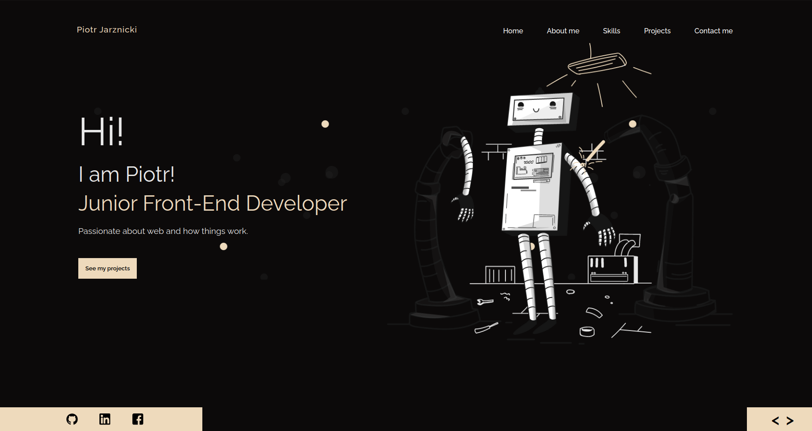

# :hammer_and_wrench: Portfolio

Junior Front-End Developer Portfolio fully created & designed by me in Adobe XD. 

## :hammer: Technology used: 

:nut_and_bolt: HTML
:nut_and_bolt: CSS/SCSS
:nut_and_bolt: JavaScript
:nut_and_bolt: Swup.js library

##  To do: 
Implement back-end which will handle contact form. 

Simply click link in the about section of this repository or click here https://piotr-jarznicki.github.io/ to live preview. 
